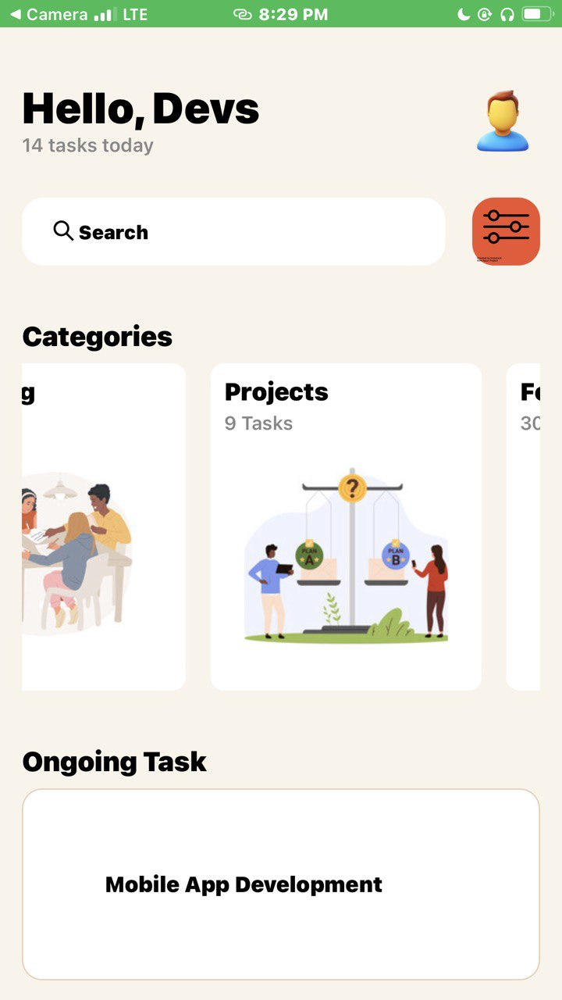
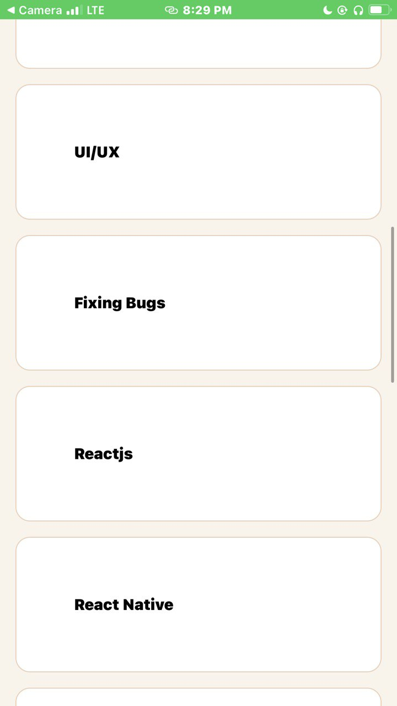

## Task Management App
Name: Oji Nana  ID:11065950

The application is designed for managing tasks in various categories.

# Description of Components

View: It works like the div tag for creating similarly container-like components for grouping objects. It supports layout with flexbox. 

Text: It is used to display text

ScrollView: A scrollable container that allows back and forth movement for multiple components

StyleSheet: It is used for defining styles similarly to creating a seperate css file or object to be reused for multiple components.

TextInput: It allows for users to enter text.

Image: For displaying images.

TouchableOpacity: It is used to give the illusion of a button.

Button: A basic button component that handles user interactions.

FlatList: For displaying a scrollable list of data. 

**Screenshots

